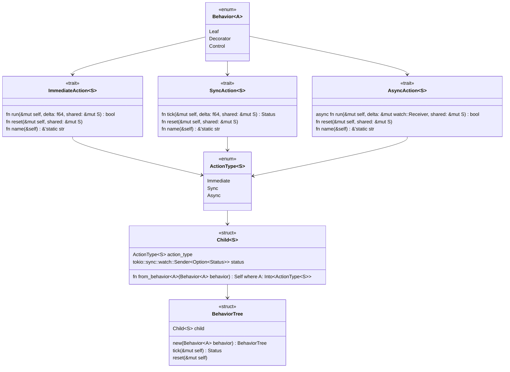

# behaviortree-rs

# Roadmap

- [x] Action trait
  - [ ] Rename from `Action` to `SyncAction`
- [x] AsyncAction trait
- [x] ImmediateAction trait
- [ ] Unify `ImmediateAction`, `SyncAction` and `AsyncAction`
- [ ] Behavior Nodes
  - [x] Wait
  - [x] Invert
  - [x] Sequence
  - [x] Select
