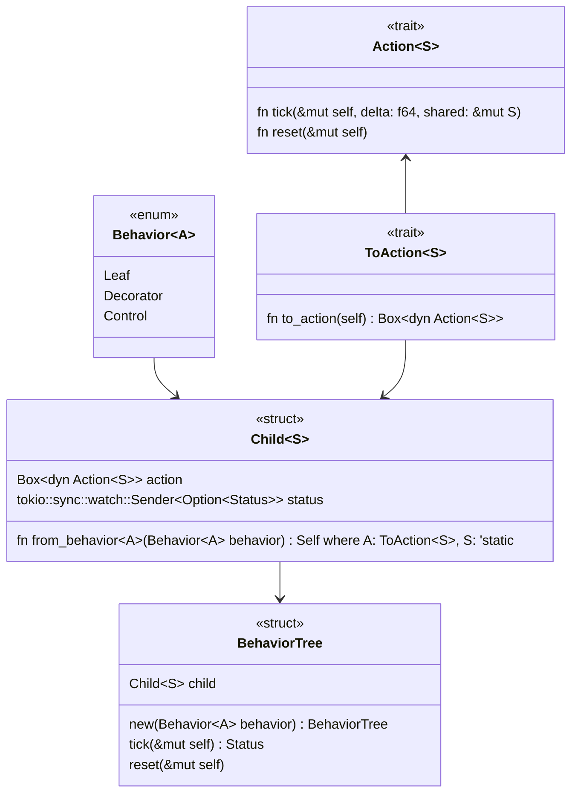

# behaviortree-rs

```mermaid
classDiagram

class Action~S~ {
    <<trait>>
    fn tick(&mut self, delta: f64, shared: &mut S)
    fn reset(&mut self)
}

class Behavior~A~ {
    <<enum>>
    Leaf
    Decorator
    Control
}

class ToAction~S~ {
    <<trait>>
    fn to_action(self) Box~dyn Action~S~~
}

class Child~S~ {
    <<struct>>
    Box~dyn Action~S~~ action
    tokio::sync::watch::Sender~Option~Status~~ status

    fn from_behavior~A~(Behavior~A~ behavior) Self where A: ToAction~S~, S: 'static
}

class BehaviorTree {
    <<struct>>
    Child~S~ child

    new(Behavior~A~ behavior) BehaviorTree
    tick(&mut self) Status
    reset(&mut self)
}

Behavior --> Child
Action <-- ToAction
ToAction --> Child
Child --> BehaviorTree
```
