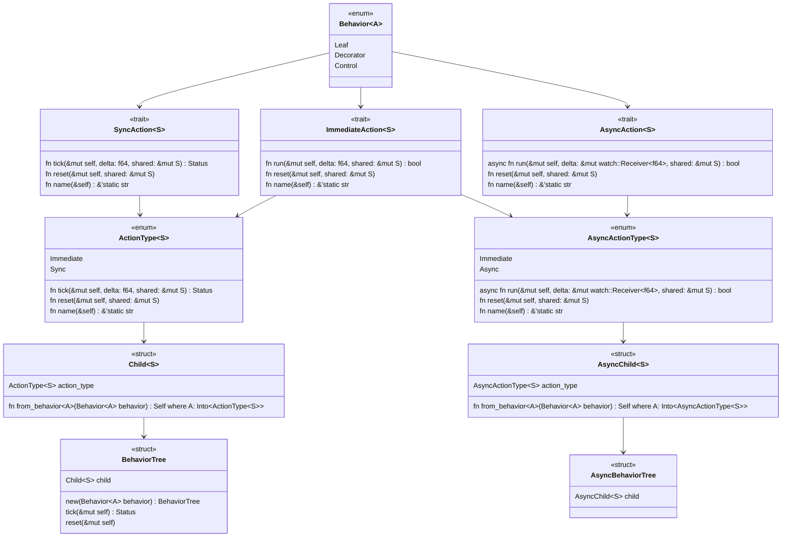

# behaviortree-rs

# Class Diagram

# Roadmap

- [x] ImmediateAction trait
- [x] SyncAction trait
- [x] AsyncAction trait
- [ ] Behavior Nodes
  - [ ] Action
    - [x] Wait
  - [ ] Decorator
    - [x] Invert
    - [ ] ForceSuccess
    - [ ] ForceFailure
    - [ ] Repeat
    - [ ] RunTillSuccess
    - [ ] RunTillFailure
  - [ ] Control
    - [x] Sequence
    - [x] Select
    - [x] Loop
    - [x] WhileAll
    - [ ] WhileAny
    - [ ] Parallel
- [x] Tracing
  - [x] BehaviorTree
  - [x] AsyncBehaviorTree
- [ ] Examples
  - [ ] BehaviorTree
    - [x] Simple Immediate
    - [ ] Simple Sync
  - [ ] AsyncBehaviorTree
    - [x] Simple Immediate
    - [ ] Simple Async
