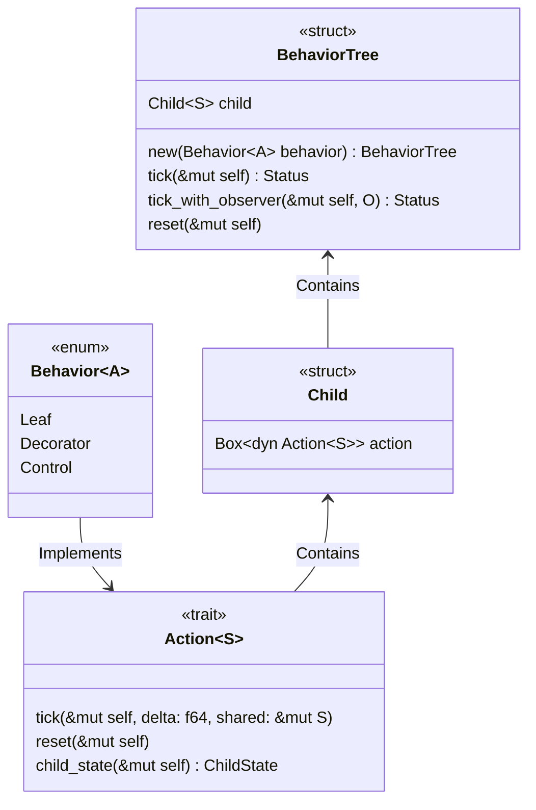

# behaviortree-rs

```mermaid
classDiagram

class Behavior~A~ {
    <<enum>>
    Leaf
    Decorator
    Control
}

class Action~S~ {
    <<trait>>
    tick(&mut self, delta: f64, shared: &mut S)
    reset(&mut self)
    child_state(&mut self) ChildState
}


class Child {
    <<struct>>
    Box~dyn Action~S~~ action
}

class BehaviorTree {
    <<struct>>
    Child~S~ child

    new(Behavior~A~ behavior) BehaviorTree
    tick(&mut self) Status
    tick_with_observer(&mut self, O) Status
    reset(&mut self)
}

Behavior --> Action: Implements

Child <-- Action: Contains

BehaviorTree <-- Child: Contains
```
