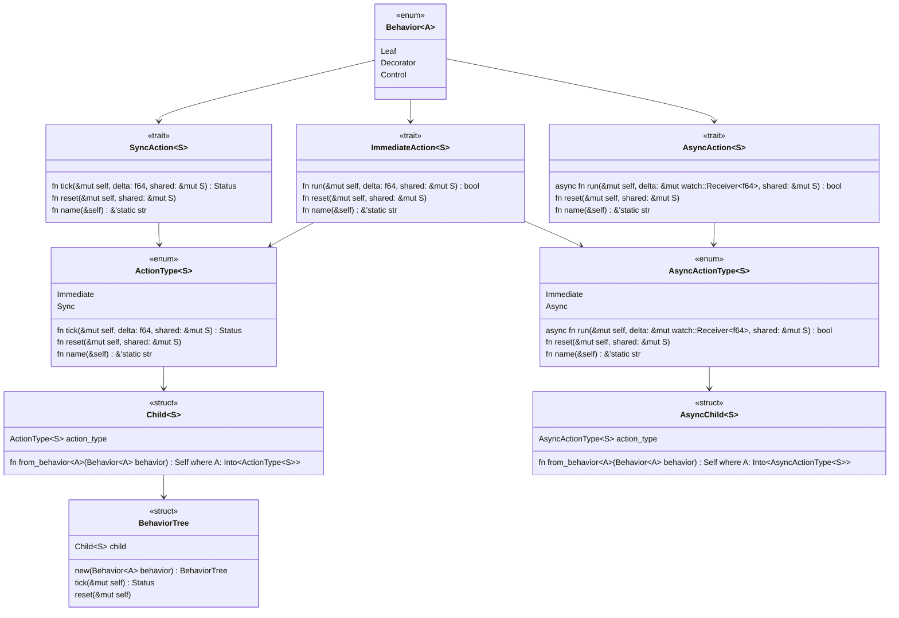

# behaviortree-rs

# Roadmap

- [x] Action trait
  - [ ] Rename from `Action` to `SyncAction`
- [x] AsyncAction trait
- [x] ImmediateAction trait
- [ ] Unification
  - [ ] Remove workspace and keep only 1 crate
  - [ ] Unify `SyncAction` with `ImmediateAction`
  - [ ] Unify `AsyncAction` with `ImmediateAction`
- [ ] Behavior Nodes
  - [x] Wait
  - [x] Invert
  - [x] Sequence
  - [x] Select
